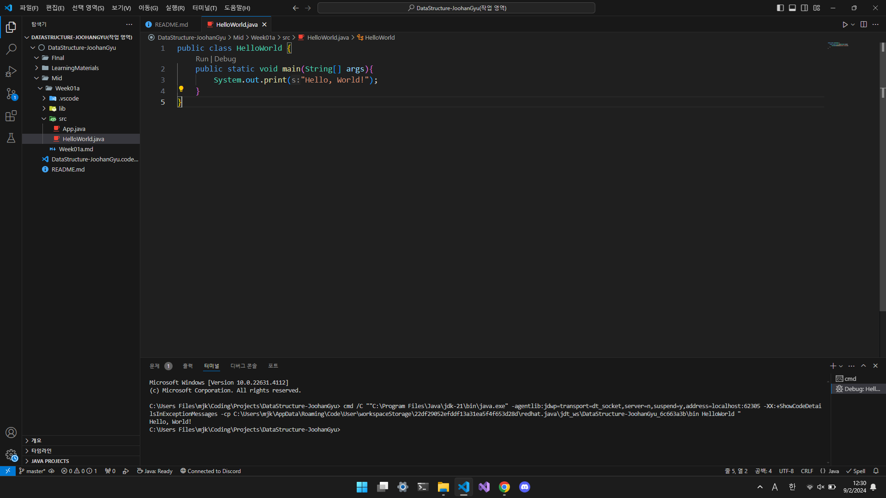

# 💻 Algorithm-JoohanGyu

## Preview

## Introduction

> 2024년 2학기 알고리즘[01]

## Evaluation method

> 중간고사 30%  
> 기말고사 35%  
> 과제 20%  
> 출석 10%  
> 태도 5%  

- A가 몇%p 인지는 확정이 아님
- 시험은 프로그래밍 관련 문제 비중이 큼